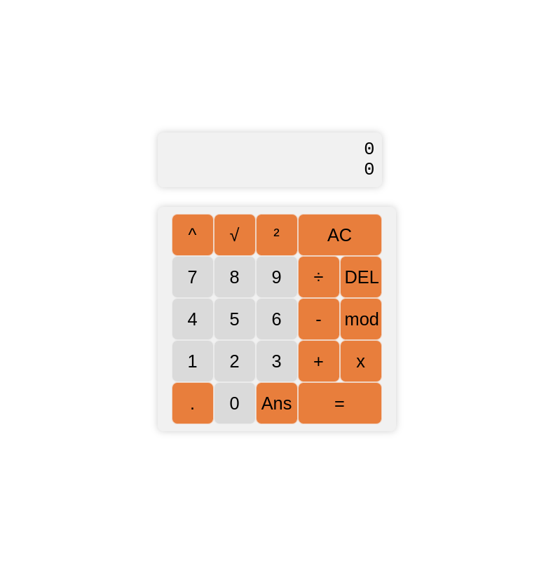

# Calculator - app

This aplication is built in React with CSS and managed in Vite.

### Installation:
- 1. Clone repository:
```shell
git clone https://github.com/Hai5edfm/calculator-project.git
```
- 2. Install project
```shell
npm run install
```
- 3. Run
```shell
npm run dev
``` 

